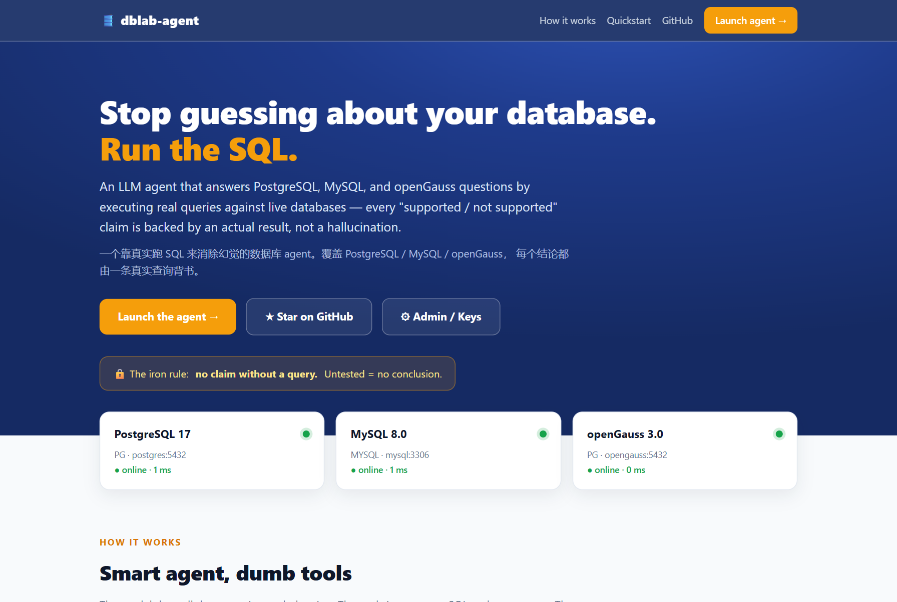
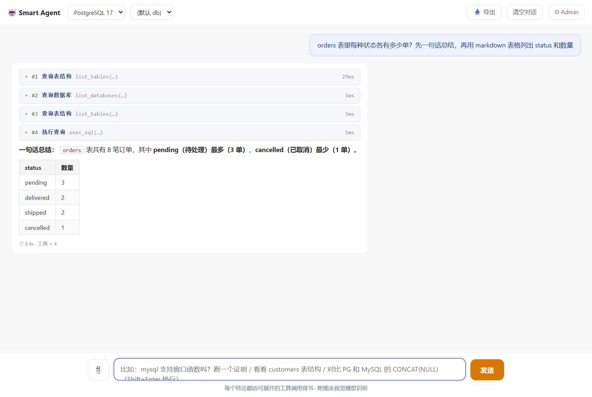

# 🛢️ dblab-agent

**An LLM agent that answers PostgreSQL / MySQL / openGauss questions by running real SQL — not by hallucinating.**


-f59e0b)
[](https://github.com/husthuangchao/dblab-agent/stargazers)

> 🔒 **The iron rule:** no claim without a query. Before the agent says a function, syntax, data type, or feature is *supported / not supported / behaves a certain way*, it **must** run a minimal test against a live database and read the actual result. **Untested = no conclusion.**

*一个靠**真实跑 SQL** 来消除幻觉的数据库 agent，覆盖 PostgreSQL、MySQL、openGauss。每一句"支持/不支持"都由一条真实查询背书——没跑过，就不下结论。*

## Screenshots

| Landing page | Smart Agent chat |
|---|---|
|  |  |

The chat shows every tool call (the exact SQL it ran and the rows it got back), then a grounded answer that labels **tested** facts apart from background knowledge.

---

## Why

Ask any chatbot "does MySQL support `X`?" and it will answer confidently — and sometimes wrongly, because it is recalling training data, not checking *your* database at *its* version. Compatibility questions across PostgreSQL, MySQL, and openGauss (a PostgreSQL-derived engine with a MySQL-compatibility story) are exactly where that confidence is most dangerous.

**dblab-agent** closes the gap. It is a *smart-agent / dumb-tools* loop: the LLM does all the reasoning and planning; the tools just execute SQL against real connections and return structured results. The model is instructed — and equipped — to **prove** every behavioural claim with a query you can expand and inspect.

为什么需要它：普通聊天机器人回答"X 数据库支不支持某语法"靠的是记忆，经常张冠李戴。本项目让模型**必须连真库跑一条最小验证 SQL** 再下结论，并把每一步工具调用透明地展示给你。

## How it works

```
                    ┌─────────────────────────────────────────────┐
  user question ──► │  agent loop  (LLM owns all reasoning)        │
                    │     │                                         │
                    │     ├─ decides which tool to call            │
                    │     ▼                                         │
                    │  ┌───────── tools (pure, no LLM inside) ──┐  │
                    │  │ list_connections  list_databases       │  │
                    │  │ list_tables       get_object_detail    │  │
                    │  │ exec_sql          exec_sql_batch        │  │
                    │  └───────────────┬─────────────────────────┘  │
                    │                  ▼                            │
                    │   pooled drivers ──► PostgreSQL / MySQL / openGauss
                    │                  ▼                            │
                    │   real rows fed back ──► grounded answer      │
                    └─────────────────────────────────────────────┘
            every step streamed to the UI as Server-Sent Events
```

The model is never asked to *be* a database; it is asked to *interrogate* one and report what it saw, labelling **tested** facts separately from background knowledge.

## Quickstart (Docker)

Spins up the agent **plus MySQL 8, PostgreSQL 17, and openGauss 3.0**, seeds them with demo data, and serves it at **http://localhost:9527** — a landing page at `/`, the chat agent at `/chat`, and the admin/keys page at `/admin`.

```bash
git clone https://github.com/husthuangchao/dblab-agent.git
cd dblab-agent
cp .env.example .env        # then put your LLM API key in .env
docker compose up -d        # first run pulls images + builds (a few minutes)
```

Open <http://localhost:9527> — the landing page shows the three databases coming
online live; click **Launch the agent** and ask, e.g.:

- *Does MySQL support window functions? Prove it.*
- *Compare `CONCAT(NULL, 'x')` behaviour across PostgreSQL and MySQL.*
- *Does openGauss support `EXPLAIN ANALYZE`? Run it.*

You only need an **OpenAI-compatible** API key. DeepSeek is the default; OpenAI, Qwen/DashScope, Moonshot, or a local Ollama all work by changing two lines in `.env`.

### Admin settings page & multimodal

Open **<http://localhost:9527/admin>** to manage the LLM keys from the browser:

- **Text / Agent model** — the SQL-running model (default DeepSeek).
- **Vision / multimodal model** — used when you attach a screenshot in chat
  (default **Zhipu GLM-4V**). Click the 📎 in the composer to drop in a SQL-error
  screenshot, schema, or monitoring panel and the vision model reads it.

Keys entered on this page are **Fernet-encrypted** into `data/settings.json`
(gitignored) and override the env defaults — no restart needed. Set
`DBLAB_ADMIN_TOKEN` to require a token before the page can save changes.

*管理页 `/admin` 可视化配置 DeepSeek（文本）与智谱 GLM-4V（多模态）两个 key；密钥加密落地，留空保留原值。聊天框 📎 可上传 SQL 报错截图交给视觉模型识别。*

> openGauss takes ~40 s on first boot. The `seeder` service waits for it; the app retries connections lazily, so the UI is usable immediately and openGauss answers come online shortly after.

## Run without Docker (local dev)

```bash
python -m venv .venv && source .venv/bin/activate     # Windows: .venv\Scripts\activate
pip install -r requirements.txt
cp .env.example .env                                   # add your LLM key

# point the demo connections at your own databases via env vars, or just add
# connections in the UI after starting:
export PG_HOST=127.0.0.1 PG_PORT=5432 PG_USER=postgres PG_PASSWORD=postgres PG_DB=demo
export MYSQL_HOST=127.0.0.1 MYSQL_PORT=3306 MYSQL_USER=root MYSQL_PASSWORD=mysql MYSQL_DB=demo

uvicorn dblab_agent.server:app --reload --port 9527
```

## Connecting your own databases

- **In the UI:** click **+ Connection**, fill in driver / host / port / user / password / database. The password is Fernet-encrypted at rest in `data/connections.json`.
- **Via env vars:** override `PG_*`, `MYSQL_*`, `OPENGAUSS_*` (see `.env.example`).

Any PostgreSQL-wire database (incl. openGauss and other PG forks) uses the `pg` driver; MySQL/MariaDB use `mysql`.

## Configuration

| Variable | Default | Purpose |
|---|---|---|
| `DBLAB_LLM_API_KEY` | — | OpenAI-compatible API key (**required**) |
| `DBLAB_LLM_BASE_URL` | `https://api.deepseek.com/v1/chat/completions` | chat-completions endpoint |
| `DBLAB_LLM_MODEL` | `deepseek-chat` | model name |
| `DBLAB_MAX_ROWS` | `100` | default row cap for `exec_sql` |
| `DBLAB_HARD_MAX_ROWS` | `500` | absolute row ceiling |
| `PG_* / MYSQL_* / OPENGAUSS_*` | demo values | built-in connection settings |

## The tools

| Tool | What it does |
|---|---|
| `list_connections` | enumerate configured connections |
| `list_databases` | list catalogs on a connection |
| `list_tables` | tables/views in a database (driver-aware scoping) |
| `get_object_detail` | columns + indexes for one object |
| `exec_sql` | run one statement, return columns/rows (the evidence tool) |
| `exec_sql_batch` | run up to 8 independent read-only queries in parallel |

Each tool is a pure function in [`dblab_agent/tools.py`](dblab_agent/tools.py) — no LLM calls inside. To add a capability, write a function and register it; the loop and UI pick it up automatically.

## Project layout

```
dblab_agent/
  config.py        env-driven settings
  config_store.py  runtime-editable LLM keys (text + vision), persisted/encrypted
  connections.py   connection registry + driver opener + custom persistence
  crypto.py        Fernet encryption for saved passwords/keys
  db_pool.py       connection pool + the exec_sql primitive
  safety.py        read/write SQL classifier
  llm.py           OpenAI-compatible chat client (stdlib only)
  tools.py         the six pure tools + registry
  agent.py         plan-and-execute loop + the anti-hallucination prompt
  server.py        FastAPI app (SSE streaming, connection API, UI)
  seed.py          idempotent demo-data loader
web/home.html      landing page (live DB status, no CDN)
web/index.html     single-file streaming chat UI (no CDN)
web/admin.html     LLM key management page
docker-compose.yml app + 3 databases + seeder
tests/             pure-logic tests (no DB required)
```

## Tests

```bash
pip install pytest
pytest -q
```

The bundled tests cover the SQL classifier, tool registry, and the agent loop driven by a fake LLM — no database or API key needed.

## Roadmap

- [ ] Streaming token-by-token final answers
- [ ] Per-connection read-only enforcement toggle
- [ ] Screenshot / error-image understanding (vision)
- [ ] Saved investigations & shareable transcripts
- [ ] More built-in dialects (MariaDB, TiDB, GaussDB)

## License

[MIT](LICENSE) © 2026 husthuangchao
